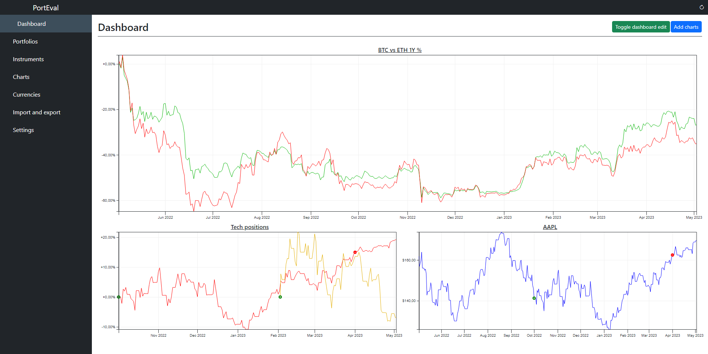

<p align="center">
    
    <a href="https://github.com/simonodm/porteval/actions/workflows/backend.yml">
        
    </a>
    <a href="https://github.com/simonodm/porteval/actions/workflows/web.yml">
        
    </a>
</p>

---

# PortEval

PortEval is a full stack web application allowing investors to aggregate, track, and evaluate their investment portfolios.

This project was developed as a bachelor's thesis at [MFF UK](https://www.mff.cuni.cz/en).

## Key features

* Tracking and management of an arbitrary number of portfolios and positions, possibly from different brokers.
* Automatic currency conversions based on the user's configured default currency.
* Automatic split retrieval and post-split adjustment.
* Integration with multiple external sources to always have up-to-date instrument prices and currency exchange rates.
* Ability to edit portfolio and instrument data as the user sees fit, including maintaining custom instruments without publicly available price.
* Ability to create highly configurable and interactive multi-line charts, allowing for easy comparison between financial metrics of various financial entities.

## Deployment

The easiest way to deploy the application is using Docker Compose files located in the root of the repository. The application can then be built and deployed using the following commands:

```
$> docker-compose build
$> docker-compose up
```

This will run the application at `http://localhost:3080`.

By default, PortEval uses Yahoo Finance and ExchangeRate.host APIs to retrieve price and exchange rate histories. While this is enough for typical usage, there is benefit in enabling other data sources for reliability reasons. Implemented data sources include Tiingo, Alpha Vantage, RapidAPI Mboum Finance, and Open Exchange Rates.

As these data sources require API keys to function correctly, these keys should be provided to the application as environment variables. In Docker Compose context, the easiest way to do so is using the [.env](.env) file.
